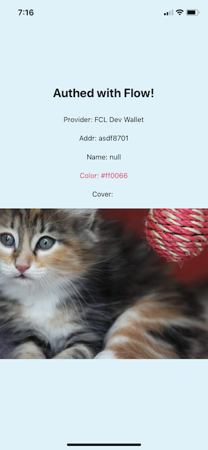

## Flow auth in React Native via Expo

Minimum demo similar to the official [quickstart](https://github.com/onflow/flow-js-sdk/tree/master/packages/fcl#quick-start) with a few hacks to work in React Native.



Hacks:

1. Adds [node-libs-react-native](https://github.com/parshap/node-libs-react-native) to polyfill the 'http' module expected by [@onflow/send](https://www.npmjs.com/package/@onflow/send)

2. Uses a local version of [@onflow/fcl](https://www.npmjs.com/package/@onflow/fcl) with a customized fcl.authenticate() function that removes DOM-specific calls to document, iframe, and window

3. Instead of re-implementing an email/pass form in an iframe, authenticate() passes a simulated data object directly to simulateMessage() which would otherwise be the event listener triggered by the iframe.

```        
const simulatedData = {
    type: 'FCL::CHALLENGE::RESPONSE',
    addr: '0000000000000000000000000000000000000004',
    paddr: 'asdf8701',
    code: '4d7e3f65-7d1c-49dd-97d8-537ba6aa462b',
    exp: '1591742214881',
    hks: 'http://192.168.1.132:8701/flow/hooks',
    nonce: 'asdf',
    l6n: null
}
```
If testing on a device and not an emulator, replace 192.168.1.132 with your localhost IP. Remember it needs to be on the same wifi network where your dev wallet is running. If using an emulator you should be able to replace that IP with just 'localhost'.